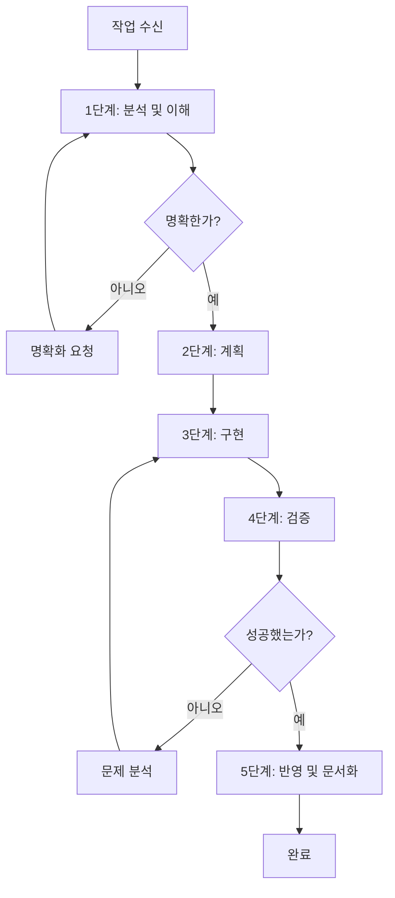

# 작업 구현 지침

> **중요**: 이 문서는 **모든 작업**에 대한 필수 프로세스를 정의합니다. **예외는 없습니다**.
> 작업을 시작하기 전에 **전체 문서**를 읽어야 합니다.

## 목차

- [핵심 원칙](#핵심-원칙)
- [워크플로우 개요](#워크플로우-개요)
- [단계별 프로세스](#단계별-프로세스)
  - [1단계: 분석 및 이해](#1단계-분석-및-이해)
  - [2단계: 계획](#2단계-계획)
  - [3단계: 구현](#3단계-구현)
  - [4단계: 검증](#4단계-검증)
  - [5단계: 반영 및 문서화](#5단계-반영-및-문서화)
- [품질 보증](#품질-보증)
- [오류 처리](#오류-처리)
- [성공 기준](#성공-기준)

---

## 핵심 원칙

이 원칙들은 **협상 불가능**하며 **모든 작업**에 적용됩니다:

1. **먼저 이해하기**: 코드를 작성하기 전에 문제, 컨텍스트 및 요구사항을 완전히 이해합니다
2. **계획 후 실행**: 구현하기 전에 항상 접근 방식을 계획하고 문서화합니다
3. **증분 진행**: 작은, 검증 가능한 단계로 작업합니다
4. **지속적인 검증**: 각 단계 후에 작업을 검증합니다
5. **명확한 커뮤니케이션**: 진행 상황, 결정 사항 및 문제를 명확하고 간결하게 문서화합니다
6. **품질 우선**: 속도보다 정확성과 품질을 우선시합니다
7. **컨텍스트 보존**: 모든 관련 컨텍스트와 이유를 문서화합니다

---

## 워크플로우 개요



---

## 단계별 프로세스

### 1단계: 분석 및 이해

**목적**: 작업, 컨텍스트 및 요구사항을 완전히 이해합니다

**필수 조치**:

1. **작업 요청 읽기**
   - 사용자 요청을 주의 깊게 읽습니다
   - 주요 요구사항을 식별합니다
   - 제약 조건이나 제한 사항을 확인합니다

2. **컨텍스트 수집**
   - 관련 파일 검토 (현재 열려 있거나 언급된 파일)
   - 기존 코드 패턴 및 규칙 이해
   - 관련 문서 또는 주석 확인

3. **범위 정의**
   - 작업 범위 내에 있는 것 식별
   - 작업 범위 외에 있는 것 식별
   - 불명확한 경우 경계 명확화

4. **요구사항 확인**
   - 모든 요구사항을 명확히 이해했는지 확인
   - 불확실한 것이 있으면 명확화 요청
   - **절대** 추측하거나 가정하지 않습니다

**출력**:
- 작업 이해 요약
- 주요 요구사항 목록
- 식별된 제약 조건 또는 종속성
- 명확화가 필요한 질문 (있는 경우)

**진행 기준**: 모든 요구사항이 명확하고 이해되었을 때만 진행합니다

---

### 2단계: 계획

**목적**: 자세한 구현 계획 생성

**필수 조치**:

1. **접근 방식 설계**
   - 가능한 접근 방식 식별
   - 장단점 평가
   - 최선의 접근 방식 선택 및 이유 정당화

2. **단계 분해**
   - 구현을 작은 단계로 나눕니다
   - 각 단계에 번호를 매기고 이름을 지정합니다
   - 단계 간 종속성 식별

3. **영향 분석**
   - 영향을 받을 파일 식별
   - 잠재적인 부작용 고려
   - 위험 평가 및 완화 계획

4. **검증 계획**
   - 각 단계에 대한 성공 기준 정의
   - 검증 방법 계획 (테스트, 수동 검증 등)

**출력**:
- 번호가 매겨진 단계가 포함된 자세한 구현 계획
- 영향을 받는 파일 목록
- 식별된 위험 및 완화 전략
- 검증 계획

**진행 기준**: 명확하고 실행 가능한 계획이 있을 때만 진행합니다

---

### 3단계: 구현

**목적**: 계획된 변경 사항 실행

**필수 조치**:

1. **증분 구현**
   - 한 번에 한 단계씩 구현합니다
   - 각 단계에 집중합니다
   - 여러 단계를 결합하지 않습니다

2. **코드 품질**
   - 기존 코드 스타일 및 규칙 준수
   - 명확하고 의미 있는 이름 사용
   - 명확한 주석 추가 (필요한 경우)
   - 모범 사례 준수

3. **컨텍스트 보존**
   - 관련 기존 코드 보존
   - 불필요한 변경 방지
   - 주요 변경 사항 문서화

4. **진행 상황 추적**
   - 완료된 각 단계 표시
   - 현재 상태 유지
   - 필요한 경우 진행 상황 보고

**출력**:
- 계획된 각 단계에 대한 구현된 변경 사항
- 수정된 파일 및 변경 사항
- 주요 결정 사항 또는 편차 문서화

**진행 기준**: 모든 계획된 단계가 구현되었을 때만 진행합니다

---

### 4단계: 검증

**목적**: 구현이 요구사항을 충족하는지 확인

**필수 조치**:

1. **기능 검증**
   - 구현이 모든 요구사항을 충족하는지 확인
   - 주요 시나리오 테스트
   - 엣지 케이스 확인

2. **코드 품질 검사**
   - 구문 오류 확인
   - 논리 오류 검토
   - 규칙 준수 확인

3. **통합 검증**
   - 기존 기능이 여전히 작동하는지 확인
   - 호환성 확인
   - 의도하지 않은 부작용 테스트

4. **문서 확인**
   - 주석이 정확한지 확인
   - README 또는 문서 업데이트 (필요한 경우)
   - 변경 로그가 완전한지 확인

**출력**:
- 검증 결과
- 발견된 문제 목록 (있는 경우)
- 테스트 결과 또는 검증 증거
- 수정이 필요한 식별된 격차

**진행 기준**: 모든 검증이 통과하고 문제가 해결되었을 때만 진행합니다

---

### 5단계: 반영 및 문서화

**목적**: 작업을 문서화하고 지속적인 개선을 위한 학습

**필수 조치**:

1. **변경 사항 요약**
   - 수행된 작업 요약
   - 주요 변경 사항 나열
   - 영향을 강조

2. **결정 사항 문서화**
   - 주요 설계 결정 사항 기록
   - 선택한 접근 방식 정당화
   - 대안 및 이들이 고려되지 않은 이유 문서화

3. **학습 캡처**
   - 직면한 도전 과제 확인
   - 배운 내용 문서화
   - 향후 개선 제안

4. **차선책 업데이트**
   - 후속 조치가 필요한 항목 나열 (있는 경우)
   - 알려진 제한 사항 문서화
   - 향후 개선 제안

**출력**:
- 변경 사항 요약
- 결정 로그
- 학습 및 개선
- 차선책 항목 (있는 경우)

**완료 기준**: 모든 문서가 완전하고 정확할 때 작업이 완료됩니다

---

## 품질 보증

모든 작업은 다음 품질 기준을 충족해야 합니다:

### 코드 품질

- [ ] 기존 코드 스타일 및 규칙을 따릅니다
- [ ] 명확하고 의미 있는 이름을 사용합니다
- [ ] 필요한 경우 적절한 주석을 포함합니다
- [ ] 일관된 형식을 유지합니다
- [ ] 모범 사례를 준수합니다
- [ ] 불필요한 복잡성을 피합니다

### 기능

- [ ] 모든 요구사항을 충족합니다
- [ ] 예상대로 작동합니다
- [ ] 엣지 케이스를 처리합니다
- [ ] 오류를 적절히 처리합니다
- [ ] 기존 기능을 깨뜨리지 않습니다

### 문서

- [ ] 변경 사항이 명확하게 문서화되었습니다
- [ ] 주요 결정 사항이 설명되었습니다
- [ ] 주석이 정확하고 유용합니다
- [ ] README 또는 문서가 업데이트되었습니다 (필요한 경우)

### 테스트

- [ ] 기능이 검증되었습니다
- [ ] 엣지 케이스가 테스트되었습니다
- [ ] 오류 처리가 확인되었습니다
- [ ] 통합이 확인되었습니다

---

## 오류 처리

**오류, 모호함 또는 차단 요소가 발생하면**:

### 즉각적인 조치

1. **중지 및 평가**
   - 진행을 일시 중지합니다
   - 문제를 분석합니다
   - 영향을 평가합니다

2. **컨텍스트 수집**
   - 관련 오류 메시지 수집
   - 환경 확인
   - 최근 변경 사항 검토

3. **해결 시도**
   - 간단한 수정 시도
   - 문제 디버그
   - 대안 고려

### 에스컬레이션

다음과 같은 경우 사용자에게 에스컬레이션합니다:

- 요구사항이 불명확하거나 모호합니다
- 여러 번 시도한 후에도 오류가 지속됩니다
- 결정이 더 넓은 컨텍스트 또는 선호도가 필요합니다
- 작업이 예상보다 중요한 변경이 필요합니다
- 현재 도구 또는 권한으로 문제를 해결할 수 없습니다

### 에스컬레이션 형식

```
🚨 명확화가 필요합니다

**문제**: [문제에 대한 명확한 설명]

**컨텍스트**: [관련 배경 정보]

**시도함**: [이미 시도한 것]

**필요함**: [필요한 것 - 명확화, 결정, 도움 등]

**옵션**: [고려된 가능한 접근 방식]
```

---

## 성공 기준

다음과 같은 경우 작업이 성공적으로 완료됩니다:

### 기능

- ✅ 모든 요구사항이 구현되었습니다
- ✅ 기능이 예상대로 작동합니다
- ✅ 엣지 케이스가 처리됩니다
- ✅ 오류가 적절히 처리됩니다
- ✅ 기존 기능이 여전히 작동합니다

### 품질

- ✅ 코드가 품질 기준을 충족합니다
- ✅ 규칙 및 모범 사례를 준수합니다
- ✅ 이름이 명확하고 의미 있습니다
- ✅ 주석이 적절하고 유용합니다
- ✅ 형식이 일관됩니다

### 문서

- ✅ 변경 사항이 문서화되었습니다
- ✅ 결정 사항이 설명되었습니다
- ✅ 학습이 캡처되었습니다
- ✅ 차선책이 식별되었습니다 (있는 경우)

### 검증

- ✅ 모든 검증이 통과합니다
- ✅ 테스트가 성공합니다 (해당하는 경우)
- ✅ 통합이 확인됩니다
- ✅ 문제가 해결됩니다

---

## 최종 체크리스트

모든 작업을 완료하기 전에 다음을 확인합니다:

- [ ] 작업이 완전히 이해되었습니다
- [ ] 자세한 계획이 생성되었습니다
- [ ] 모든 단계가 구현되었습니다
- [ ] 변경 사항이 검증되었습니다
- [ ] 품질 기준이 충족되었습니다
- [ ] 문서가 완전합니다
- [ ] 문제가 해결되거나 에스컬레이션되었습니다
- [ ] 학습이 캡처되었습니다
- [ ] 성공 기준이 충족되었습니다

---

## 기억하세요

> **이 프로세스는 선택 사항이 아닙니다.** 모든 작업에 필수이며 예외는 없습니다.
> 품질과 이해를 속도보다 우선시합니다.
> 의심스러우면 명확화를 요청합니다.
> 추측하지 마세요 - 질문하세요.

---

**이 지침에 대한 질문이나 명확화가 필요하면 계속하기 전에 요청하세요.**
